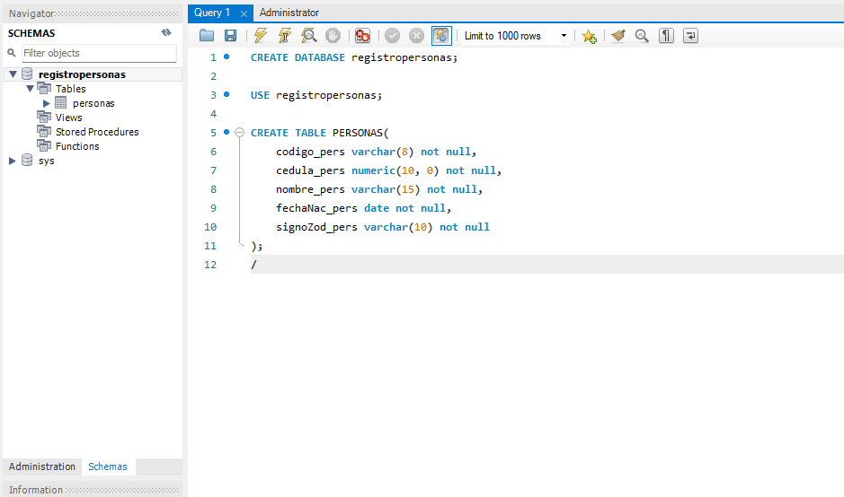

# Sistema CRUD con JavaFX y conexión a MySQL
## Integrantes
- Delgado Bryan
- Espinel Brittany
- Sangucho Melany
---
## Versiones de software utilzados
| Nombre                 | Versión | Descargar                                                                                                                                                                                                                                                                 |
|------------------------|---------|---------------------------------------------------------------------------------------------------------------------------------------------------------------------------------------------------------------------------------------------------------------------------|
| JavaFX                 | 2.1.1   | 👉 [Descargar JavaFX](https://gluonhq.com/products/javafx/)                                                                                                                                                                                                               |
| Java SDK               | 17 - 20 | 👉 [Descargar Java SE 20](https://download.oracle.com/java/20/archive/jdk-20.0.2_windows-x64_bin.exe)                                                                                                                                                                     |
| IntelliJ IDEA Ultimate | 2023.02 | 👉 [Descargar IntelliJ](https://www.jetbrains.com/idea/download/?source=google&medium=cpc&campaign=9736964635&term=intellij&content=602143185583&gad=1&gclid=CjwKCAjw_uGmBhBREiwAeOfsd57cMmQwdn6h7EAsBYomBJ8E7aMmiZiucGg0EDmxwZgGm8YVwT2WThoC27gQAvD_BwE&section=windows) |                                                                                                  |
***
## Antecedentes del proyecto
- ### Análisis del entorno JavaFX  

JavaFX es una plataforma que permite a los desarrolladores crear e implementar fácilmente aplicaciones de Internet enriquecidas que se comportan de la misma forma en distintas plataformas. 
Amplía la potencia de Java permitiendo a los desarrolladores utilizar cualquier biblioteca de Java en aplicaciones JavaFX. Los desarrolladores pueden ampliar sus capacidades en Java y utilizar la tecnología de presentación que FX proporciona para crear experiencias visuales que resulten atractivas.  
  - ### Características de JavaFX
    - Permite a los desarrolladores integrar gráficos vectoriales, animación, sonido y activos web de vídeo en una aplicación interactiva, completa y atractiva.

    - Amplía la tecnología Java permitiendo el uso de cualquier biblioteca de Java en una aplicación JavaFX.

    - Permite mantener un eficaz flujo de trabajo entre diseñador y desarrollador en el que los diseñadores pueden trabajar en las herramientas que deseen mientras colaboran con los desarrolladores.

  - ### Ventajas
    - JavaFX es una extensión a la plataforma Java que ofrece interactividad, animación y programación compatible con AJAX, Flash de Adobe y Silverlight de Microsoft.

    - Se trata de un sistema de desarrollo para la web que pretende competir con el Flash de Adobe y el Silverlight de Microsoft, con el añadido de que es Open Source.

    - Millones de desarrolladores, muchos equipos con Java instalado y a eso hay que sumar que Java es libre bajo GPL.

    - Multiplataforma, desde el escritorio (corriendo sobre una máquina virtual Java SE) hasta los dispositivos móviles para los que habrá un JavaFX Mobile.

    - Utiliza el mismo lenguaje para la web, para el escritorio y para la telefonía móvil.
    
  - ### Desventajas
    - Con JavaFx, se agrega un lenguaje de script complejo, que necesita mantener en memoria su propia estructura semántica y sus propios objetos de plataforma, simultáneamente con los objetos gráficos.

    - Al ser un lenguaje de script agrega un factor de ralentización importantísimo, por eso el desempeño no es óptimo.

    - Por otro lado, las API de tratamiento de XML ya vienen incorporadas al JDK, generalmente están implementadas a bajo nivel, por lo que un sistema de templates es mucho mas liviano que soportar JavaFX.
***
- ### Análisis de MySQL  

  
MySQL es un sistema de gestión de bases de datos relacional desarrollado bajo licencia dual: Licencia pública general/Licencia comercial por Oracle Corporation y está considerada como la base de datos de código abierto más popular del mundo, y una de las más populares en general junto a Oracle y Microsoft SQL Server, todo para entornos de desarrollo web.

- ### ¿Qué es un sistema CRUD?
  

En pocas palabras, CRUD resume las funciones requeridas por un usuario para crear y gestionar datos. Varios procesos de gestión de datos están basados en CRUD, en los que dichas operaciones están específicamente adaptadas a los requisitos del sistema y de usuario, ya sea para la gestión de bases de datos o para el uso de aplicaciones.
CRUD hace referencia a un acrónimo en el que se reúnen las primeras letras de las cuatro operaciones fundamentales de aplicaciones persistentes en sistemas de bases de datos:
- ***Create (Crear registros)***
- ***Read bzw. Retrieve (Leer registros)***
- ***Update (Actualizar registros)***
- ***Delete or Destroy (Borrar registros)***

---
## Proceso de desarrollo
- ### Funcionamiento del sistema
  - ### Conexión con MySQL
  La conexión con MySQL se realiza mediante la instalación o agregado de librerías __(llamadas JConnectors)__ dentro del proyecto de Java.
  Para este desarollo se utiliza este software, que permite la comunicación del IDE y el lenguaje con la DB, facilitando la creación del sistema CRUD.    
  

  - El JConnect comunica a la base con el sistema, se establece mediante:
    - **URL de la base**
    - **Puerto predeterminado (*o el puerto asignado para la comunicacion*)**
    - **Usuario y contraseña (*si la posee*), de la DB**
  
    
  
    - ### Query database
    Para poder definir el esquema de la base de datos, se emplea un elemento de programación de DB, llamado Query,
    este mismo permite el realizar, editar y establecer los elementos de la base.   
    A partir de este QUERY se crea la base de datos con su respectiva tabla (registropersonas > personas). Este esquema contiene toda la
    información guardada dentro de la DB y poder __modificarla mediante el sistema CRUD de JavaFX.__
    
      
---
## Anexos
- ### Capturas de funcionamiento